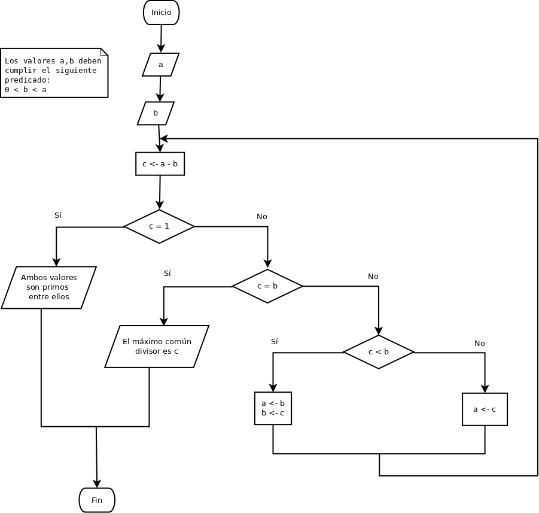
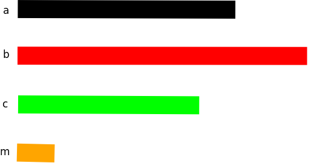

% Ejemplos de implementaciones bajo diferentes paradigmas de programación
% S4N Campus
% 2020/10/19

# Ejemplo de paradigmas de programación
## Algoritmo de Euclides.

Uno de los algoritmos más viejos conocidos es el llamado [algoritmo de
Euclides](https://es.wikipedia.org/wiki/Algoritmo_de_Euclides), que
básicamente describe como se calcula el máximo común divisor entre dos
números enteros. El algoritmo no es original de Euclides, sino que era
conocido mucho antes de su era. Euclides da una de las primeras
descripciones conocidas. El algoritmo describe como se debe calcular
el Máximo Común Divisor (MCD) entre dos número entero. Es utilizado la
resolución de ecuaciones indetermindadas que conducen a la [identidad
de Bézout](https://es.wikipedia.org/wiki/Identidad_de_B%C3%A9zout). El
matemático persa Omar al-Kayyyäm lo utilizó para comparar dos
proporciones y determinar sin son verdaderas. También aparecen dentro
de la escritura de [fracciones continuas estudiadas por
Euler](https://es.wikipedia.org/wiki/Fracci%C3%B3n_continua_de_Euler). También
ha sido utilizado en dentro del [teórema de
Sturm](https://es.wikipedia.org/wiki/Teorema_de_Sturm) para determinar
el número de raices reales de una equación algebraica.

### Definición

En la siguiente figura se observa el algoritmo de Euclides:

El programa comienza leyendo dos variables a y b. Ambas deben cumplir
con la precondición que allí se indica.  Una vez leído los dos
valores, calcula c con la diferencia entre a y b. Verifica que ambos
valores tienen una diferencia de uno se consideran que los valores
originales de a y b son primos relativos entre ellos. Sino, si el
valor de c es igual a b indica que es un múltiplo entre a y b, por lo
tanto c es el máximo común divisor entre ambos. Sino, si c es menor
que b, a pasa a tomar el valor de b y b toma el valor de c, en caso
contrario a toma el valor de c, volvemos a ejecutar el algoritmo.

Una versión en seudocódigo de este programa, haciendo este una función
queda así, de una forma más estructurada:

---
Language: Seudocode
---
    mdc(a,b)
       c = a - b
       Mientras c != 1 ó c != b haga
          Si c < b entonces
    	     a = b
             b = c
          Sino
             a = c
          FinSi
          c = a - b
       FinMientras

Esta es una versión muy cercana a la original,  ahora miremos una
versión diferente que utiliza el siguiente seudocódigo:

---
Language: Seudocode
---
    mcd(a,b)
       Si a = b entonces a
       Sino Si a < b entonces mcd(a,b-a)
            Sino mcd(a-b,b)

Esta es una definición que utiliza la misma definición (recursiva)
para definir el máximo común divisor.

Ahora, utilicemos el algoritmo para resolver un problema de
programación y resolverlo utilizando tres de los parádigmas:
imperativo, funcional y lógico.

## Problema

Se leen tres números enteros, cada uno representa la longitud de un
cable, que posiblemente son diferentes. Se quiere cortar los cables de
forma tal que todos los segmentos sean iguales.

### Propuesta de solución

La idea es utilizar una implementación del algoritmo de máximo común
divisor para solucionar el problema. La idea es encontrar el máximo
común divisor entre las tres longitudes de los cables. En la siguiente
figura se observa la idea de problema donde se reciben tres longitudes
de segmentos: a, b y c. La idea es encontrar un m que encaje
perfectamente en los tres segmentos y permita contarlos en segmentos iguales.

Utilizando el algoritmo de MCD (Máximo Común Divisor ó Algoritmo de
Euclides) podemos encontra el tamaño máximo entre dos segmentos. Vamos
a indicar que la relación de MCD es una relación transitiva (sin hacer
demostraciones matemáticas), es decir si comparamos dos elementos y
encontramos su MCD, este también estará en relación con el tercer
elemento, por lo tanto podemos aplicar una operación que funcione de
la siguiente forma:

---
language: seudocode
---
    m1 = mcd(a,b)
    m = mcd(c,m1)

Donde m es el MCD de los tres valores: a, b, y c. Se puede lograr una
optimización extra:

---
language: seudocode
---
    m = mcd(c, mcd(a,b))

En este caso m es el MCD de los tres valores. Entonces, nuestra
implementación (programa) lee los tres valores: a, b y c. Y aplicando
la anterior solución se puede obtener el segmento mínimo m entre los
tres segmentos.

#### Implementación en su lenguaje favorito

Implemente la anterior solución utilizando su lenguaje de programación
favorito (Java, Pytho, Ruby, etc.).

#### Implementación Imperativa

Vamos mostra la implementación en un lenguaje imperativo, en este caso
el lenguaje de programación C++, este un lenguaje multiparadigma
(estructurado, orientado a objetos y funcional).

##### Implementación del algoritmo de Euclides en C++.

El siguiente es el código del la implementación de C++ del algoritmo
de euclides (MCD-en Inglés gcd), con algunas optimizaciones para no utilizar la variable
intermedia c.

---
language: C++
---
    int gcd(int a, int b) {
       while (a != b)
          if (a > b)
             a = a - b;
          else
             b = b - a;
       return a;
    }

Observe esta implementación y responda lo siguiente:

1. Muestre cada iteración del código anterior llenando la siguiente tabla

+-----+-----+
|  a  |  b  |
+:---:+:---:+
| 12  |  8  |
|     |     |
|     |     |
+-----+-----+

2. Muestre cada iteración del código anterior llenando la siguiente tabla

|  a  |  b  |
|:---:|:---:|
|  9  |  8  |
|     |     |
|     |     |

3. ¿Es posible identificar que dos valores son primos entre ellos?
4. Si se cumple con la precondición: 0 < b < a. ¿Siempre termina?
5. Si no se cumple con la precondición. ¿Qué pasaría?
6. ¿El programa podría retornar el valor de b? ¿Sirve para todos los casos?
7. Observando el código anterior y el algoritmo de Euclides al
principio de esta sección. ¿Cómo se logro eliminar el valor de la
variable c?
8. Reescriba el anterior código utilizando la variable c. *Nota:*
tenga en cuenta que en C++ los bloques de dos o más instrucciones
deben dentro de llaves { }.

La siguiente es la implementación del código principal del programa:

---
language: C++
---
    int
    main(void) {

      std::cout << "Enter three integer values separated by spaces: ";
      std::cout.flush();

      int a, b, c;

      std::cin >> a >> b >> c;

      std::cout << "The minimum size to cut is: "
                << gcd(gcd(a, b),c)
                << std::endl;

      return 0;
    }

En primer lugar, se hace explícito el orden a través de la secuencia de operaciones.
Se imprime un mensaje para la lectura de los valores, luego se hace una declaración
de variables, se invoca la función gcd dos veces: primero con las variables a y b, y
el resultado se pasa computar la segunda invocación y se obtiene el resultado mínimo.

##### Implementación de solución en Haskell.

En los lenguajes funcionales puros como Haskell la definición de las función se hace a través
utilizando declaración por partes y recursividad. La definición de la función MCD(gcd) es la siguiente

---
language: Haskell
---
    gcd' :: Int -> Int -> Int
    gcd' x y
      | x ==  y   = x
      | x <   y   = gcd' x       (y - x)
      | otherwise = gcd' (x - y) y

En primer lugar el nombre de la función gcd' es definida de forma distinta, puesto
que la biblioteca Prelude ya tiene definida una. La primera línea muestra la firma
de la función que específica que se reciben dos parámetros de tipo entero y se retorna
un valor entero. Si se observa bien, se podría recibir un parámetro y devolver una función.
La segunda línea muestra que se reciben dos parámetros nombrados x y y. Estos no se modifican.
La tercera línea muestra la primera definición, si ambos valores son iguales, ya se tiene el resultado.
La cuarta línea muestra la definición que si el valor de x es menor que y, se vuelve a invocar la
función gcd' pero esta ves utilizando como parámetros a x y el valor de (y - x).
La quinta línea muestra la definición en cualquier otro caso, se vuelve a invocar la función
gcd' con (x -y) como primer parámetro y y como segundo. Esto continua hasta que ambos valores son iguales,
en cuyo caso terminará.

El siguiente parte de código muestra como un lenguaje declarativo interactúa con el mundo exterior:

---
language: Haskell
---
    readInts :: IO (Int,Int,Int)
    readInts = do
     str <- hGetLine stdin
     let [s1,s2,s3] = words str
     return (read s1, read s2, read s3)

    main :: IO ()
    main = do
      hPutStr stdout "Enter three integer values separated by spaces: "
      hFlush stdout
      (a,b,c) <- readInts
      hPutStrLn stdout $ "The minimum size to cut is: " ++ (show $ gcd' c (gcd' a b))
      return ()

En Haskell las funciones que interactúan con el mundo exterior tiene
como constructor IO y como valor de retorno que se indica después, en
este caso () que indica que el valor es un valor de tipo void
(semejante al void en Java, C ó C++). Se han definido dos funciones
que interactúan con el mundo exterior, la primera readInts se encarga
de obtener los tres valores a ser procesados, esta función interactúa
con el mundo exterior y retorna una tupla con los tres valores leídos.
Aunque el código sea semejante a un código imperativo, este esa
simulando la interacción con el mundo exterior, el sistema de tipos de
Haskell garantiza que la función siempre se evalúa en el tiempo
obtiene los mismos resultados siempre (Esto nos puede sonar extraño
pero es así). La segunda función main es la encargada de dar inicio al
programa, es semejante en ejecución a la función main de nuestro
programa en C++, pero es importante notar que debido al compromiso de
no modificar el estado del programa este programa es diferente en
algunas partes, como por ejemplo en la parte de la invocación de la
función gcd' que si observa bien los parámetros son tratados
individualmente. Observe en la siguiente extracción de código

---
language: Haskell
---
    gcd' c (gcd' a b)

La primera función trabajo con dos parámetros, c y el resultado de la
invocación de la función interna gcd' que a su vez recibe dos
parámetros a y b.

##### Implementación de solución en Prolog.

El último lenguaje que examinaremos aquí es el lenguaje de
programación Prolog, este es un ejemplo de lenguaje de programación lógico.
Observemos en primer lugar la declaración del predicado gcd:

---
language: Prolog
---
    gcd(X,Y,G) :- X = Y, G = X.
    gcd(X,Y,G) :- X < Y, Y1 is Y - X, gcd(X, Y1, G).
    gcd(X,Y,G) :- X > Y, gcd(Y, X, G).

Aunque luce muy similar al declaración de la función en el lenguaje de
programación Haskell.  Existen varias diferencias. En primer lugar,
gcd no es una función, es realidad una cláusula que tiene como tres
variables, donde X y Y son las variables de los valores obtener su
máximo común divisor; G es la variable que contendrá el resultado
final. Cada cláusula tiene dos partes: la cabeza y el cuerpo (este es
opcional). La cabeza incluye el nombre de la cláusula y sus parámetros
(si los tiene). El cuerpo tiene una lista de términos que puede ser
hechos o predicados que se deben cumplir para hacer verdadera la
cabeza de la cláusula. Si clásula no tiene cuerpo es un predicado, en
caso contrario se llama una regla. En este ejemplos tenemos tres cláusulas con cuerpo, que son tres reglas.

La primera regla dice que los valores de X y Y son iguales, el
resultado G es el primero de ellos. La segunda regla indica que si la
relación X < Y es verdadera, se obtiene un resultado intermedio Y1 se
computa restando a Y el valor de X y se verifica el nuevo predicado:

---
language: Prolog
---
    gcd(X, Y1, G)

La tercera regla, verifica si la relación X > Y se cumple y si es así,
verifica que el predicado:

---
language: Prolog
---
    gcd(Y, X, G)

Cómo se puede observar estas reglas no indican el orden que se deben evaluar,
si una de las reglas es verdadera en todo su cuerpo hace que su conclusión sea verdadera.

¿Qué pasa si hay más de una regla que se cumple? Simple, cada valor es
válido. Esto establece una diferencia con la programación funcional
donde solo se puede obtener un único valor, en la programación lógica
se puede tener múltiples resultados o ninguno. Esto es una gran diferencia con los otros tipos de programación.

En el siguiente código, se observa la parte que se comunica con el mundo exterior.

---
language: Prolog
---
    process :-
        current_input(Input),
        write("Enter three integer values separated by spaces: "),
        read_string(Input,  " ", " \r\t", _, Number1),
        number_string(Number1_n,Number1),
        read_string(Input,  " ", " \r\t", _, Number2),
        number_string(Number2_n,Number2),
        read_string(Input, "\n", " \r\t", _, Number3),
        number_string(Number3_n,Number3),
        gcd(Number1_n, Number2_n,Tmp),
        gcd(Number3_n, Tmp, Result),
        number_string(Result,ResultStr),
        write("The minimum size to cut is: "),
        write(ResultStr),nl.

Esta regla process no tiene variables, pero tiene un cuerpo que debe cumplir cada uno
de los términos, mucho de esto terminos que tiene que ver con la comunicación con el
mundo exterior. Luce similar al programa en C++, debido a que su comportamiento es igual.

